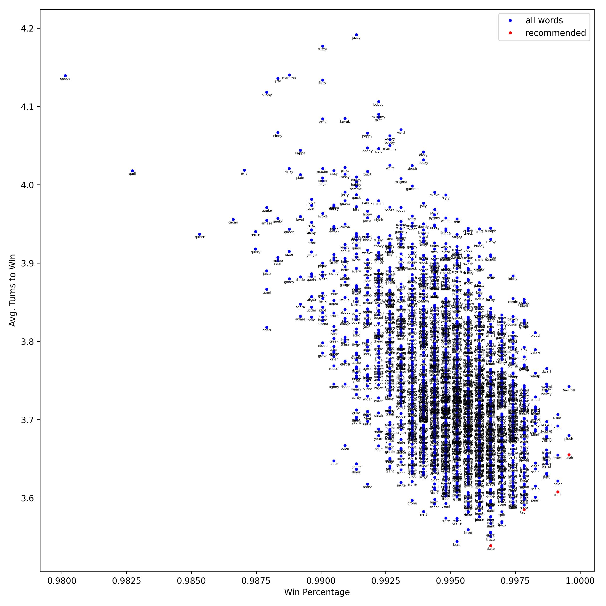

# wordle

Fastest [Wordle](https://www.powerlanguage.co.uk/wordle/) solver in the West.

* 99.83% success rate
* 3.597 average turns to win

Or use the `--mode win-percentage` flag to optimize for success rate (see below). In that case, you can't lose if your first guess is RALPH. ¯\\_(ツ)_/¯


## Install

Install directly from this repository:
```bash
pip install git+https://github.com/fkodom/wordle.git
```

## Solve

Launch the assistive solver:
```bash
solve-wordle
```

## Play

Visit the **[Public Web App](https://share.streamlit.io/fkodom/wordle/main/app.py)**, or play a command line game:
```bash
play-wordle
```

## Benchmarks

Full details in [benchmarks.jsonl](data/benchmarks.jsonl).

* Accuracy (99.83%) and turns-to-win (3.597) are averages over recommended starting words, using default settings
* RALPH has the highest win percentage (99.95%)
* SLATE has the fewest turns to win (3.539)
* BLAST is a good balanced choice (99.91%, 3.608)

**NOTE:** RALPH has a 100% win percentage if you use the `--mode win-percentage` flag.



## How It Works

Exactly solving for word probabilities requires an exhaustive search through all possible word combinations. (There are way too many to be fast or practical.) Instead, we approximate them using a cheaper method.

### Maximum Split

Each guess should eliminate as many possible words from the word bank as possible. The "maximum split" method does just that: 
* iterate through each possible `(guess, target)` pair
* measure the number of remaining possible words for each pair
* recommend guesses that give the smallest average numbers of remaining words.

### Word Probability

A few definitions:

>  --> probability of character $c$ at position $i$ in the word
> 
>  --> probability of character $c$ at any position
> 
>  --> probability of a word ($c_1$, $c_2$, $c_3$, $c_4$, $c_5$)
> 
>  --> counts of character $c$ in word $w$
> 
>  --> counts of character $c$ in the remaining word bank


Very roughly speaking, the word probability scales with each of $p_i(c)$ and $p(c)$:

<!-- $$p(w) \sim \prod_i p_i(c_i) \, p(c_i)$$ -->
<p style="text-align:center;"></p>

Then,  and  can be approximated from the remaining possible words, just by counting the frequencies of different letters. Then, to avoid over-counting from words with repeated letters, we divide by the number of identical permutations. 

<!-- $$p(c) \sim \frac{n_{c}}{n_{all} \cdot n_c(w)!}$$ -->
<p style="text-align:center;"></p>

### Hybrid (Default)

The "maximum splits" method is more accurate, but it's slow when the number of remaining words is large. So as a hybrid method:
* If >128 possible words remain, use **word probability**
* Otherwise, use **maximum split**

The `--mode win-percentage` flag uses exhaustive search once the number of remaining words drops below 16. It's somewhat of a hack, but you win a slightly higher percentage of games. Unless RALPH is your starting word, it's probably too small of a difference to notice.
